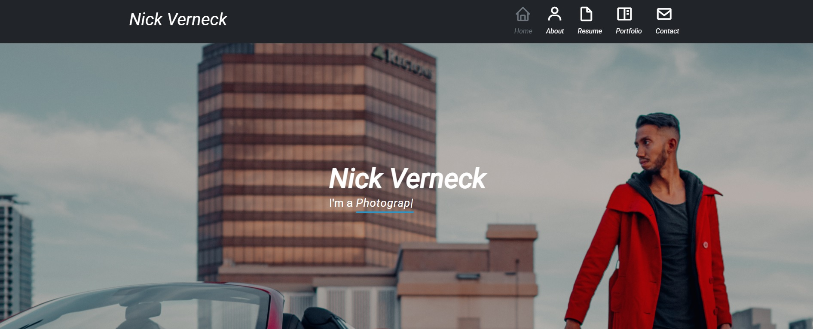
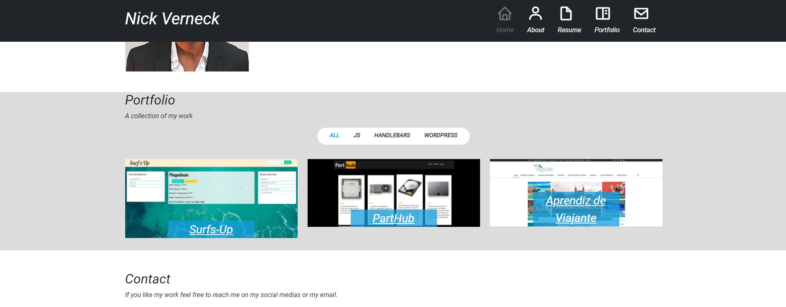
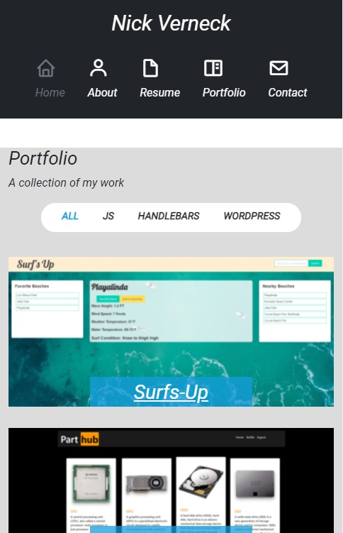

# Portfolio
This is my portfolio page using ReactJS , bootstrap, and some JS libraries for some visual effects.
Header, hero, About, and contact were divided into react components to make the page load faster.

### live link https://nick-portfolio-react.herokuapp.com/



## Table of Contents 
* [Installation](#installation)
* [Questions](#questions)
## Installation
To install necessary dependencies, run the following command:
```
npm i
```
## Questions
If you have any questions about the repo, open an issue or contact me directly at nicollas@gmail.com. 
You can find more of my work at [nickverneck](https://github.com/nickverneck/).

